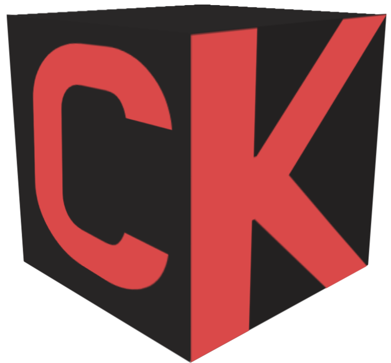

<div align="center">


<p align="center">
  
</p>

[](https://godotengine.org/)
[](https://docs.godotengine.org/en/stable/tutorials/scripting/gdscript/index.html)
[](LICENSE)
[](https://github.com/seriouslych/crimson/stargazers)

**Crossplatform Game Launcher with 3D box art visualization 🎮**

[English](#english) | [Русский](#russian)

---

</div>

<a name="english"></a>

## About

**Crimson Konsole** is a modern game launcher with a beautiful 3D interface that displays your games as physical box art in a coverflow-style presentation. Built with Godot Engine 4.6, it combines aesthetic appeal with practical functionality.

### Key Features

- **🎨 3D Coverflow Interface** - Browse your games in stunning 3D with smooth animations
- **🎮 Multi-Platform Support** - Works on Windows and Linux
- **📦 Multiple Box Types** - Support for Xbox, PlayStation, PC, Nintendo formats
- **🖼️ Auto Cover Download** - Integration with SteamGridDB for automatic cover art
- **⏱️ Play Time Tracking** - Track how long you've played each game
- **🎯 Gamepad & Keyboard Support** - Full support for Xbox, PlayStation, and generic controllers
- **🌍 Multilingual** - English, Russian, and Japanese localization
- **🎵 Music Player** - Built-in music player with vinyl style
- **✏️ Game Management** - Easy adding, editing, and organizing of games

### Supported Box Types

- 🟦 PC/Steam
- 🟩 Xbox (Original, 360, One)
- 🔵 PlayStation (1-5)
- 🔴 Nintendo (N64, GameCube, Wii, Switch)

## 🚀 Installation

### Prerequisites

- Operating System: Windows 10+, Linux
- Display: 1920x1080 recommended
- Storage: ~100MB for application + space for game covers

### Download

1. Download the latest release from [Releases](https://github.com/Crimson-Core/crimson-konsole/releases)
2. Extract the archive
3. Run `CrimsonKonsole2.0.exe` (Windows) or the `CrimsonKonsole2.0.x86_64` executable 

### Building from Source

```bash
# Clone the repository
git clone https://github.com/Crimson-Core/crimson-konsole.git
cd crimson-konsole

# Open in Godot 4.6+
# Project -> Export -> Select your platform
```

## Usage

### Adding Games

1. Press `ESC` or `Start/Menu/Options/+` (Generic/Xbox/DS4/NSwitch) button to open the side panel
2. Select **"Add Game"**
3. Enter game name and select platform type
4. Choose the game executable
5. (Optional) Download covers automatically or select custom images
6. Press **"Done"** to save

### Navigation

#### Keyboard
- `↑/↓` - Navigate between games
- `Enter` - Launch game
- `ESC` - Open side panel
- `Tab` - Edit selected game

#### Gamepad
- `D-Pad` - Navigate between games
- `1/A/Cross/B Button` - Launch game
- `Start/Menu/Options/+` - Open side panel
- `Select/View/Share/-` - Edit selected game

### Managing Games

1. Select a game
2. Press `Tab` (keyboard) or `Select/View/Share/-` button (gamepad)
3. Edit game details:
   - Change name
   - Update executable path
   - Replace cover art
   - Delete game

## Technical Stack

- **Engine**: Godot 4.6
- **Language**: GDScript
- **3D Rendering**: Godot's 3D renderer with custom shaders
- **Cover API**: SteamGridDB integration via steamboxcover
- **Audio**: Built-in Godot audio with some effects
- **Input**: Support for keyboard, mouse, and gamepad (DInput, XInput, DualShock, Nintendo)

## Configuration

Settings are stored in:
- **Windows**: `%APPDATA%/Godot/app_userdata/Crimson Konsole/`
- **Linux**: `~/.local/share/godot/app_userdata/Crimson Konsole/`

### Config Files

- `settings.cfg` - Application settings
- `games/*.json` - Individual game data
- `game_times.json` - Play time tracking
- `covers/` - Downloaded cover images

## License

This project is licensed under the terms specified in the [LICENSE](LICENSE) file.

## Special thanks to:
- [Godot Engine](https://godotengine.org/) - Amazing open-source game engine
- [SteamGridDB](https://www.steamgriddb.com/) - Cover art database
- [Kenney](https://kenney.nl/) - Input prompt assets
- [Godot Shaders](https://godotshaders.com/shader/balatro-background-shader) - Amazing balatro background shader
- All testers
- [@EpitaphNewell](https://github.com/EpitaphNewell) for initial design and concept

---

</div>

<a name="russian"></a>

## О проекте

**Crimson Konsole** — это современный игровой лаунчер с красивым 3D-интерфейсом, в котором игры отображаются как настоящие физические коробки в стиле coverflow. Сделан на Godot Engine 4.6, сочетает в себе приятный внешний вид и нормальный функционал.

### Основные фичи

- **🎨 3D Coverflow** — листаешь игры в 3D с плавными анимациями, выглядит круто
- **🎮 Мультиплатформенность** — работает на Windows и Linux
- **📦 Разные типы коробок** — поддержка форматов Xbox, PlayStation, PC, Nintendo
- **🖼️ Автозагрузка обложек** — интеграция со SteamGridDB, обложки скачиваются сами
- **⏱️ Учёт времени** — видно сколько ты уже потратил времени на каждую игру
- **🎯 Геймпад и клавиатура** — полная поддержка Xbox, PlayStation и обычных контроллеров
- **🌍 Несколько языков** — есть английский, русский и японский
- **🎵 Музыкальный плеер** — встроенный плеер в стиле виниловых пластинок
- **✏️ Управление играми** — легко добавлять, редактировать и упорядочивать игры

### Поддерживаемые типы коробок

- 🟦 PC/Steam
- 🟩 Xbox (Original, 360, One)
- 🔵 PlayStation (1–5)
- 🔴 Nintendo (N64, GameCube, Wii, Switch)

## 🚀 Установка

### Что нужно

- ОС: Windows 10+ или Linux
- Дисплей: рекомендуется 1920x1080
- Место на диске: ~100 МБ для самого приложения + место под обложки

### Скачать

1. Скачай последний релиз со страницы [Releases](https://github.com/Crimson-Core/crimson-konsole/releases)
2. Распакуй архив
3. Запусти `CrimsonKonsole2.0.exe` (Windows) или `CrimsonKonsole2.0.x86_64` (Linux)

### Собрать из исходников

```bash
# Клонируй репозиторий
git clone https://github.com/Crimson-Core/crimson-konsole.git
cd crimson-konsole

# Открой в Godot 4.6+
# Project -> Export -> выбери свою платформу
```

## Использование

### Добавить игру

1. Нажми `ESC` или кнопку `Start/Menu/Options/+` (Generic/Xbox/DS4/NSwitch), чтобы открыть боковую панель
2. Выбери **«Добавить игру»**
3. Введи название и выбери платформу
4. Укажи путь до исполняемого файла
5. (Необязательно) скачай обложку автоматически или выбери свою
6. Нажми **«Готово»**

### Навигация

#### Клавиатура
- `↑/↓` — переключаться между играми
- `Enter` — запустить игру
- `ESC` — открыть боковую панель
- `Tab` — редактировать выбранную игру

#### Геймпад
- `D-Pad` — переключаться между играми
- `1/A/Cross/B` — запустить игру
- `Start/Menu/Options/+` — открыть боковую панель
- `Select/View/Share/-` — редактировать выбранную игру

### Редактирование игры

1. Выбери игру
2. Нажми `Tab` (клавиатура) или `Select/View/Share/-` (геймпад)
3. Можно изменить:
   - Название
   - Путь до исполняемого файла
   - Обложку
   - Удалить игру

## Технологии

- **Движок**: Godot 4.6
- **Язык**: GDScript
- **3D**: рендерер Godot с кастомными шейдерами
- **API обложек**: интеграция со SteamGridDB через steamboxcover
- **Звук**: встроенный аудио Godot с эффектами
- **Ввод**: клавиатура, мышь, геймпад (DInput, XInput, DualShock, Nintendo)

## Конфигурация

Настройки хранятся здесь:
- **Windows**: `%APPDATA%/Godot/app_userdata/Crimson Konsole/`
- **Linux**: `~/.local/share/godot/app_userdata/Crimson Konsole/`

### Файлы конфигурации

- `settings.cfg` — настройки приложения
- `games/*.json` — данные по каждой игре
- `game_times.json` — учёт времени
- `covers/` — скачанные обложки

## Лицензия

Проект распространяется на условиях, указанных в файле [LICENSE](LICENSE).

## Отдельное спасибо:
- [Godot Engine](https://godotengine.org/) — офигенный движок с открытым исходным кодом
- [SteamGridDB](https://www.steamgriddb.com/) — база данных обложек
- [Kenney](https://kenney.nl/) — иконки для управления
- [Godot Shaders](https://godotshaders.com/shader/balatro-background-shader) — крутой шейдер фона в стиле Balatro
- Всем тестировщикам
- [@EpitaphNewell](https://github.com/EpitaphNewell) — за изначальный дизайн и концепцию

---

<div align="center">

Made with ❤️ using Godot Engine

**[⬆ Back to Top](#)**

</div>
